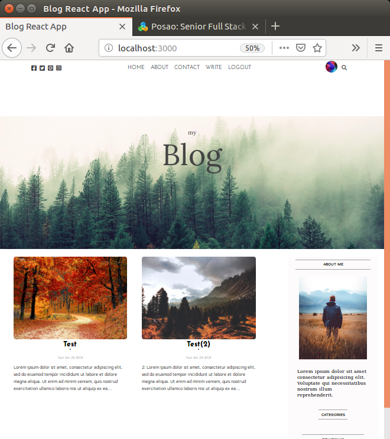
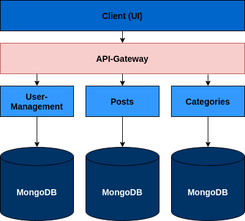
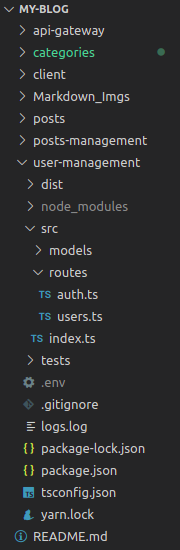
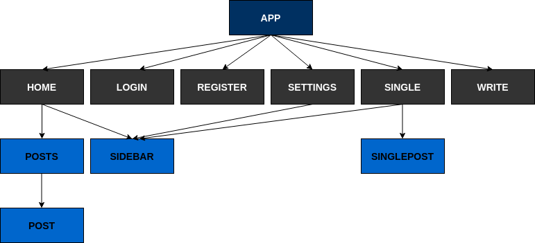

# my-blog

## Projektbeschreibung: 

Die Anwendung ist eine in react und node geschriebene Blog-Webseite. Die Anwendung besteht aus einem Backend-Teil (REST-API mit node) und einem Frontend-Teil (mit react), dabei wird sowohl im Frontend, als auch im Backend TypeScript benutzt. Als ein Benutzer dieser Anwendung hat man die Möglichkeit Blogbeiträge zu Veröffentlichen, aber auch Beiträge anderer Benutzer zu sehen. Somit ist bei der Anwendung eine Buntzerverwaltung, als auch eine Verwaltung der Posts (Blog-Beiträge) vorhanden.

#### Architektur (Microservice):
Die Microservice-Architektur der Anwendung setzt sich aus folgenden Services zusammen:
- client: der Client ist das Frontend der Anwendung, welcher auf dem Port 3000 läuft (also http://localhost:3000).
- api-gateway: der API-Gateway ist eine Middelware in der Anwendung, es dient als eine Schicht zwischen dem Frontend und den Backend Services. Der API-Gateway läuft auf dem Port 5000 (also http://localhost:5000).
- categories: der Categories-Service stellt Schnittstellen zur Verfügung, die in irgendeiner Art mit Kategorien zu tun haben. Der Service läuft auf dem Port 6000 (also http://localhost:6000).
- user-management: der User-Management-Service verwaltet alle Benutzerdaten und stellt entsprechende Schnittstellen zur Verfügung die mit Benutzerdaten der Anwendung zu tun haben. Der Service läuft auf dem Port 7000 (also http://localhost:7000).
- posts: der Posts-Service stellt Schnittstellen zur Verfügung, die in irgendeiner Art mit Posts zu tun haben. Der Service läuft auf dem Port 8000 (also http://localhost:8000).

Am Beispiel der Ordnerstruktur des Services user-management kann man erkennen, das jeder Service in TypeScript geschrieben ist, im Ordner tests die entsprechenden Test-Scripte aufbewahrt und eine eigene Log-Datei ("logs.log") besitzen, wo die Aktivitäten der Anwendung protokolliert werden.

#### Backend:
Das  Backend, also  die  REST-API  besteht aus  folgenden  Schnittstellen, welche  für das Frontend zur Verfügung stehen:
- POST /register
     Dieser Endpoint dient der Registrierung, dabei werden Benutzername, Email undPasswort entnommen und mit den Daten wird in der Datenbank ein Benutzer neuangelegt.
- POST /login
     Dieser Endpoint dient um sich als ein existierender Benutzer einzuloggen, dabeiwerden Benutzername und Passwort entnommen und mit den Daten aus der Da-tenbank überprüft. Abhängig davon, ob der angegebene Benutzer existiert, wirdentsprechend eine passende Antwort zurückgesendet, sodass man sich entwedererfolgreich eingeloggt hat, oder das etwas schief gelaufen ist.
- POST /categories
     Mit diesem POST-Endpoint kann man eine neue Kategorie speichern.
- GET /categories
     Mit diesem GET-Endpoint kann man sich alle gespeicherten Kategorien zurückge-ben lassen, um diese dann anzeigen zu können.
- POST /posts
     Dieser Endpoint speichert einen Post eines Benutzers.
- PUT /posts/:id
     Mit diesem Endpoint kann man einen Post bearbeiten, solange der Benutzer auchder ursprüngliche Verfasser des Postes ist.
- DELETE /posts/:id
     Mit diesem Endpoint kann man einen Post löschen, solange der Benutzer auch derursprüngliche Verfasser des Postes ist.
- GET /posts/:id
     Mit diesem Endpoint kann man einen Post öffnen, um alle Informationen des Postessehen zu können.
- GET /posts
     Mit diesem GET-Endpoint kann man sich alle gespeicherten Posts aller Benutzerzurückgeben lassen, um diese dann anzeigen zu können.
- PUT /users/:id
     Mit diesem Endpoint kann man die Profil-Daten eines Benutzers bearbeiten.
- DELETE /users/:id
     Mit diesem Endpoint kann man einen Benutzer löschen.
- GET /users/:id
     Mit diesem  Endpoint kann  man  sich die  Profil-Daten  eines  Benutzers  anzeigenlassen.

#### Frontend:
Die Webseite des Frontends setzt sich aus folgenden Unterseiten zusammen:
- Home,
- Login,
- Register,
- Settings,
- Single,
- Write.

Um Funktionalitäten der Webseite nutzen zu können, muss zu erst ein registrierter undeingeloggter Benutzer sein, somit ist die erste Anlaufstelle die Register- und Login-Seite,welche durch Ihren Namen selbsterklärend sind. Auf der Unterseite "Home" kann manPosts aller Benutzer sehen, was somit auch die Startseite der Anwendung darstellt. Fallsman nähere Informationen zum eingeloggten Benutzer sehen und bearbeiten möchte, sokann man dies unter den "Settings" erledigen. Die Unterseite "Single" geht auf wenn maneinen Post öffnet, dabei kann man den vollständigen Post sehen, bearbeiten und löschen.Wenn man einen neuen Post verfassen möchte, dann kann man dieses Formular auf derUnterseite "Write" umsetzen.

